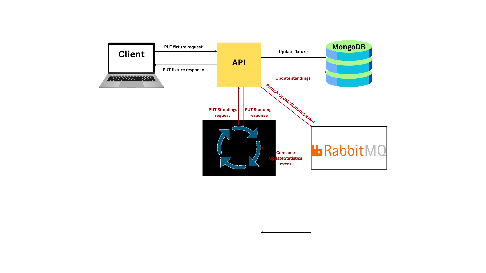

# Go Football League

A football league API written in Go (Golang) to mimic basic CRUD operations on Teams, Fixtures and Standings.

The Go Football League consists of the following infrastructure:

- `API`: Provides endpoints for CRUD operations on Teams, Fixtures, and Standings
- `RabbitMQ`: The messaging service, facilitating communication between the API and other components through event queues
- `Consumer`: A long-lived service that that listens for UpdateStatistics events in the queue and processes them

### The Rationale for an Event-Driven Architecture with RabbitMQ

In designing this API, I opted for an event-driven architecture with RabbitMQ to address both performance and maintainability concerns. The main scenario that drove this decision involves the `Update Fixture` endpoint. When a fixture is updated, it triggers a cascade of operations, such as recalculating goal difference, points and updating other metrics.

Instead of coupling the `Update Fixture` endpoint to these additional tasks, I chose to decouple these responsibilities using RabbitMQ. Why is this better?

#### 1. Improved Performance Through Asynchronous Processing

The `Update Fixture` endpoint focuses solely on its primary responsibility which is to update the relevant fixture and once done, it immediately emits an UpdateStatistics event to a RabbitMQ queue. This ensures the endpoint completes its core task quickly, without waiting for potentially time-intensive processes such as recalculating points, goal differences, and league standings. These resource-heavy tasks are handled asynchronously by a dedicated consumer service. By offloading these tasks to a separate consumer, the API avoids introducing delays, leading to faster respones.

Here is a graph to show the flow of these activities:

#### 2. Scalability and Modularity

The event-driven approach keeps services modular and independent, making it easier to scale individual components. New features can be added to process additional events without disrupting existing functionality.

### Plans for a React UI

In the future, I plan to create a simple UI in React where users can see fixtures by gameweeks, update these fixtures and view the league standings based on the scores submitted.
